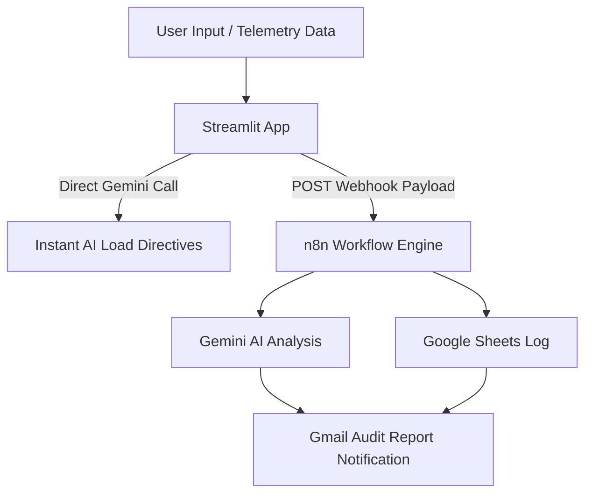
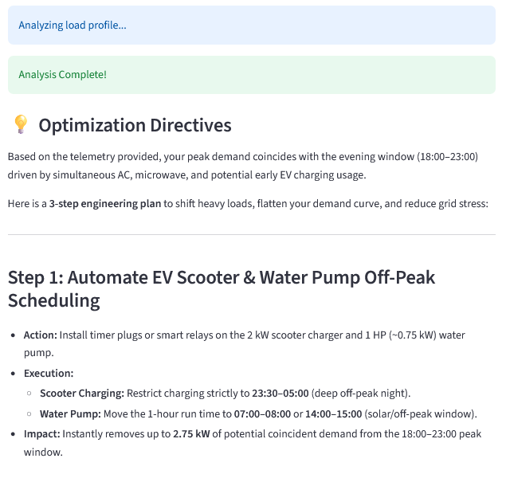
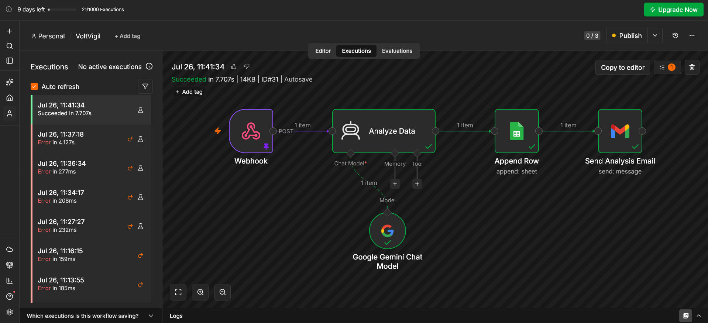
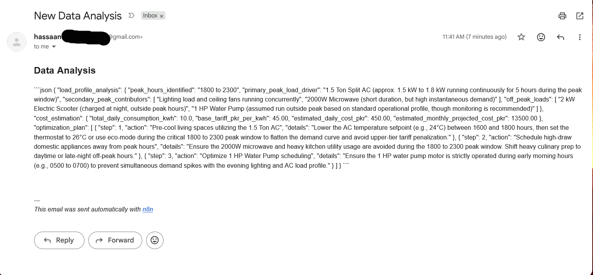

# ⚡ VoltVigil: AI-Powered Residential Energy Auditor & Load-Shifting Pipeline

> 🚀 **Live Application:** [Click here to launch the VoltVigil App](https://voltvigil.streamlit.app/#volt-vigil-smart-home-energy-auditor)

An end-to-end, intelligent energy management platform that captures telemetry data from residential distribution networks, conducts engineering-grade load profile analysis using **Google Gemini**, and triggers an automated orchestration pipeline via **n8n** to update Google Sheets logs and deliver real-time actionable directives straight to an engineer's inbox.

## 🎯 Architecture Overview

## ✨ Key Features

* **Real-time Telemetry Processing:** Accepts user inputs for household appliance runtimes, peak hour usage, and total daily kilowatt-hour ($\text{kWh}$) consumption.
* **LLM Engineering Analysis:** Integrates Google's `gemini-flash-latest` model to deliver structured load profile breakdowns, cost-impact estimations, and 3-step peak load-shifting directives.
* **Automated Webhook Pipeline:** Leverages an **n8n** automation engine to process data asynchronously without blocking UI execution.
* **Centralized Data Audit:** Automatically logs run telemetry and AI analysis results to a Google Sheets database for long-term power system auditing.
* **Instant Email Dispatch:** Sends formatted engineering reports directly to the user's Gmail inbox upon workflow execution.

---

## 🛠️ Tech Stack & Dependencies

* **Frontend / Dashboard:** [Streamlit](https://streamlit.io/) (Python)
* **AI Model & SDK:** [Google GenAI SDK](https://github.com/google-gemini/deprecations) (`google-genai` / `gemini-flash-latest`)
* **Workflow Automation:** [n8n Cloud](https://n8n.io/)
* **Integrations:** Google Sheets API, Gmail API
* **Deployment:** Streamlit Community Cloud & GitHub Actions

---

## 🚀 Local Setup & Installation

### Prerequisites
* Python 3.10+ installed
* A valid Google AI Studio API Key

### 1. Clone the Repository
bash
git clone (https://github.com/retroguy08/VoltVigil.git)
cd VoltVigil

2. Install Dependencies
Bash

pip install -r requirements.txt

3. Configure Local Secrets

Create a .streamlit/secrets.toml file in the root directory and add your credentials:
Ini, TOML

GOOGLE_API_KEY = "your_google_ai_studio_api_key_here"
WEBHOOK_URL = "your_n8n_webhook_production_url_here"

4. Run the Streamlit Application
Bash

streamlit run APP.py

## 📸 System Screenshots

### 1. Interactive Streamlit Interface & Live AI Analysis

### 2. Active n8n Automation Engine

### 3. Data Logging & Email Delivery Verification

